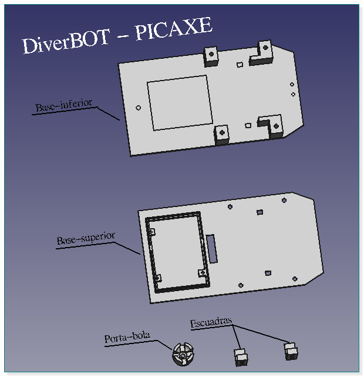

# DiverBOT
Coche robótico y centro de entrenamiento electrónica 4ºESO.
Hemos diseñado un coche robótico que nos va a servir para comenzar a aprender los fundamentos básicos de la electrónica analógica y nos va a introducir en el mundo de las placas de control con PICAXE. Estos talleres están pensados para su uso en el **Taller de Tecnología**.

El diseño lo hemos realizado con FreeCAD gracias a las enseñanzas de maestro [@obijuan_cube](https://twitter.com/Obijuan_cube).

[+INFO](https://github.com/profesoratecno/DiverBOT-PICAXE/wiki)
